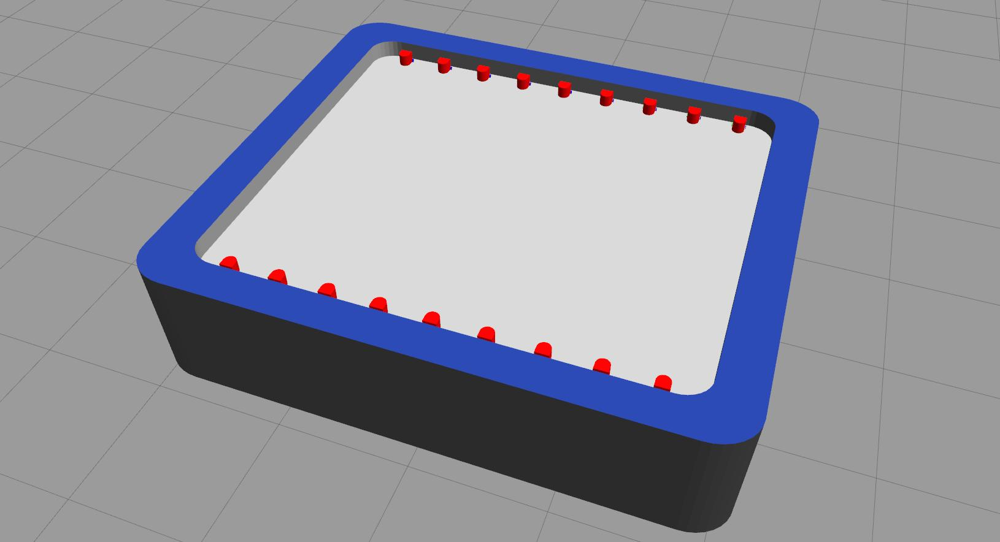

# ros2_robotarium

`ros2_robotarium` is a series of ROS2 packages aimed at bringing a 3D simulation of the [Georgia Tech Robotarium](https://www.robotarium.gatech.edu/) for the following novices, researchers, and enthusiasts:

* New roboticists that would like an easy-to-use ROS2 multi-robot system with a real-world physical counterpart to apply your algorithms or learn.
* 3D simulation needs for those who feel the current Robotarium 2D simulator may be lacking.
* Swarm Robotics researchers particularly those trying to work with machine learning and reinforcement learning algorithms.

## Installation

The package has been tested to work on **ROS2 Foxy** and **Gazebo >10** for **Ubuntu 20.04**. Future or previous versions may work, but they may require tinkering if errors pop-up!

### Install ROS2

[This](https://index.ros.org/doc/ros2/Installation/Foxy/) link will direct you to the installation instructions for the latest version of ROS2 (Foxy). Please follow the instructions and install the right version for your system.

### Create a ROS2 Workspace

Create a workspace using the following command:

```bash
~$ mkdir -p ~/robotarium_ws/src
```

Next, change directory (`cd`) to `src` directory you just created:

```bash
~$ cd ~/robotarium_ws/src
```

Clone this repository within the `src` folder:

```bash
~$ git clone -b foxy-devel https://github.com/zmk5/ros2_robotarium.git
```

Finally, change directory back to `robotarium_ws`, build using `colcon`, and source the newly built files for use:

```bash
~$ cd ..
~$ colcon build --symlink-install
~$ . install/setup.bash
```

## Running your first simulation

Before running the simulation, export the location of the GRITSBot and Robotarium arena models provided by the package so Gazebo knows where to locate them:

```bash
~$ export GAZEBO_MODEL_PATH=$GAZEBO_MODEL_PATH:~/robotarium_ws/src/ros2_robotarium/robotarium_gazebo/models
```

If you would like to make this permanent, add it to your `.bashrc` file. **Make sure to only run this once though!**

```bash
~$ echo 'export GAZEBO_MODEL_PATH=$GAZEBO_MODEL_PATH:~/robotarium_ws/src/ros2_robotarium/robotarium_gazebo/models' >> ~/.bashrc
```

Now you can run a test simulation with the following command:

```bash
~$ ros2 launch robotarium_bringup spawn_robot.launch.py
```

You should get the following arena:



Congratulations! You have no started your first ROS2 Robotarium simulation!


## Tutorials

**UNDER CONSTRUCTION**

## Citation

If you do plan on using this system, I urge you to cite the original Robotarium if you can!

[Here is the paper!](https://liwanggt.github.io/files/Robotarium_CSM_Impact.pdf)
